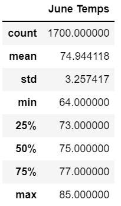
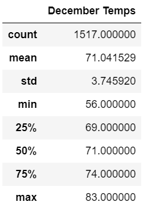

# Surfs-Up

## Overview
The purpose of this analysis is to compare the temperature statistics of Hawaii in June and December to understand if running a year round surf shop is viable. 

## Results

Here we can see a summary of some statistics for June and December

- In June we can see a 3 degree higher mean temperature compared to December
- The standard deviations are very similar in with a difference of about 1/2 degree. This shows that the variance between temperatures during the summer and winter is not that different.
- The max temp in June is 85 vs in December it is 74. 

## Summary
Given the means this shows that the June temps are right skewed meaning that there will be a greater number of entries closer or slightly below the mean showing that the general temperature difference between the months is not as different as it may initially seem.

I we wanted to gather more data we could do the following:
- Query outside factors like precipitation as that would be a determining factor as to how many people would come to the shop to surf
- Do a similar query for all of the months to see a trend of temperature differences between all months to see the variance of temperature changes between them.